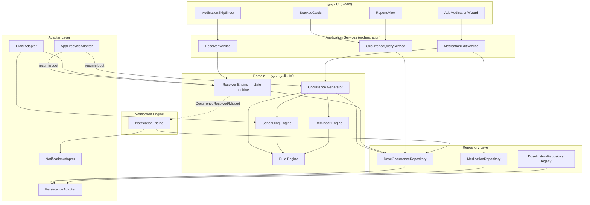
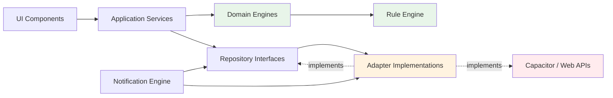

# بازطراحی معماری زمان‌بندی داروتو — Dose Occurrence Architecture

**نسخه:** ۱.۰ — Design Document (Single Source of Truth)
**وضعیت:** پیش‌نویس برای تصمیم‌گیری معماری — هیچ کدی پیاده‌سازی نشده است.
**دامنه‌ی بررسی:** کل پروژه (`src/`) — تحلیل کامل پیش از طراحی انجام شد.

---

## فهرست

0. خلاصه‌ی تحلیل سیستم فعلی (چرا این بازطراحی لازم است)
1. Domain Model
2. Scheduling Engine
3. Occurrence Generator
4. Resolver Engine
5. Reminder Engine
6. Notification Engine
7. Rule Engine
8. Repository Layer
9. Adapter Layer
10. Migration Strategy
11. Architecture Diagram
12. Dependency Graph
13. فایل‌هایی که باید تغییر کنند
14. ترتیب مهاجرت (اجرایی، فاز به فاز)
15. ریسک‌ها
16. Edge Cases
17. پنل خانه — تصمیمات جدید نمایش کارت‌ها (Home Presentation Layer)

---

## ۰. خلاصه‌ی تحلیل سیستم فعلی

پیش از طراحی، کل پروژه بررسی شد: `src/types/index.ts`، `src/utils/doseSchedule.ts`،
`src/services/notificationService.ts`، `src/services/storageService.ts`، `src/App.tsx`،
`src/components/home/StackedCards.tsx`، `src/components/reports/ReportsView.tsx`،
`src/components/medications/AddMedicationWizard.tsx`، `src/components/home/MedicationSkipSheet.tsx`
و `src/data/*`.

### ریشه‌ی واقعی مشکل

سیستم فعلی اصلاً «Occurrence» به معنای یک entity مستقل ندارد. هر چیزی که شبیه یک
«دوز مشخص» به نظر می‌رسد، در لحظه‌ی رندر یا در لحظه‌ی تیک ۳۰ ثانیه‌ای، از روی
`Medication.times` + «الان» + یک رشته‌ی تاریخ محاسبه می‌شود. هویت هر دوز، ترکیب
`(medId, slotIndex, date-string)` است — نه یک id مستقل. این باعث می‌شود «امروز»
و «الان» به‌صورت ضمنی در همه‌جا پخش شوند:

| محل | کد مشکل‌ساز | مشکل |
|---|---|---|
| `App.tsx` (missed check) | `now.toISOString().split('T')[0]` | تاریخ بر اساس UTC محاسبه می‌شود، نه تقویم محلی کاربر |
| `ReportsView.tsx` | `new Date().toISOString().split('T')[0]` (۳ جای مختلف) | همان باگ، در گزارش‌گیری هم تکرار شده |
| `StackedCards.tsx` | `todayStr = new Date().toISOString().split('T')[0]` | همان باگ، در تشخیص «امروز» برای صف کارت‌ها |
| `doseSchedule.ts` → `computeCurrentDoseWindow` | حدس‌زدن slot سررسیدشده از روی `now.getHours()/getMinutes()` | فقط «امروز» را می‌فهمد؛ اگر اپ چند روز باز نشود، هیچ occurrence گذشته‌ای برای catch-up وجود ندارد |
| `notificationService.ts` | id نوتیفیکیشن = `hash(medId + slot + kind)` | id قطعی است ولی به یک occurrence واقعی گره نخورده — فقط یک «اسلات» تکرارشونده |
| `StackedCards.tsx` → `allInstances` | فقط از روی `medicationTimeSlots(m)` ساخته می‌شود | **باگ واقعی و فعلی:** `selectedDays` (روزهای هفته) و `monthDay` (ماهانه) اصلاً چک نمی‌شوند — داروی «دوشنبه/چهارشنبه» هر روز کارت و نوتیفیکیشن تولید می‌کند |
| `App.tsx` → `handleUpdateDoseStatus` | لاگ جدید با `id: 'log_' + Math.random()...` به آرایه اضافه می‌شود | resolve فقط append است، نه state machine روی یک entity واحد |

نتیجه: باگ نیمه‌شب، تداخل نوتیفیکیشن، تداخل کارت، خطای missed و خطای resolve که در
درخواست ذکر شده‌اند، همگی **یک علت ریشه‌ای مشترک** دارند — نبود یک Aggregate مستقل
به اسم **Dose Occurrence** که زمان‌بندی، وضعیت و نوتیفیکیشن‌هایش را خودش با خودش حمل کند.

نکته‌ی مثبت که باید حفظ شود: منطق فرمول یادآوری سه‌گانه (`reminder1 = T0+15m`,
`reminder2 = T0 + interval/4`, `deadline = T0 + min(interval/2, MAX_ALLOWED_DELAY_HOURS)`)،
و استثنای داروهای `safetyLevel: critical` / `isSingleDose`، و مدل «per-slot نه
per-medication» درست و آگاهانه طراحی شده‌اند. این‌ها در معماری جدید **حفظ می‌شوند**
فقط جایشان عوض می‌شود (از توابع محاسبه‌ی زنده به یک ReminderPlan ذخیره‌شده روی خود Occurrence).

---

## ۱. Domain Model

### فلسفه‌ی طراحی

هسته‌ی مدل، **DoseOccurrence** است: یک رخداد واقعی و مستقل مصرف دارو، با هویت خودش،
که به‌محض ساخته‌شدن دیگر تغییر نمی‌کند (فقط `status`ش می‌تواند یک‌بار transition کند).
همه‌ی چیزهایی که امروز به‌صورت زنده محاسبه می‌شوند (ددلاین، یادآورها، پله‌ی escalation)
در لحظه‌ی **تولید** occurrence یک‌بار محاسبه و روی خودش ذخیره می‌شوند؛ دیگر هیچ‌جای
دیگری از سیستم دوباره این محاسبه را با یک «الان»ِ تازه تکرار نمی‌کند.

### Aggregate ها و Value Object ها

```
Medication (Aggregate Root)
 ├─ id
 ├─ name, form, dose, catalogId, ...  (بدون تغییر نسبت به امروز)
 ├─ schedule: MedicationSchedule        ← جدید — جایگزین times/frequency/selectedDays/...
 ├─ safety: MedicationSafetyProfile     ← مشتق از catalog، فقط cache شده
 └─ isActive, pauseReason

MedicationSchedule (Value Object — immutable، هر تغییر نسخه‌ی جدید می‌سازد)
 ├─ scheduleVersion: number             ← هر ویرایش دارو نسخه را +۱ می‌کند
 ├─ frequencyType: 'daily' | 'interval' | 'weekly' | 'monthly'
 ├─ slots: ScheduleSlot[]
 ├─ selectedWeekdays?: Weekday[]        ← فقط weekly
 ├─ monthDay?: number                   ← فقط monthly
 ├─ intervalHours?: number              ← فقط interval
 ├─ scheduleStartAt?: Instant
 └─ timezoneId: string (IANA, مثل 'Asia/Tehran')   ← جدید — صراحتاً ذخیره می‌شود

ScheduleSlot (Value Object)
 ├─ slotId: string                      ← جدید — id پایدار، مستقل از ایندکس آرایه
 ├─ timeOfDay: { hour, minute }
 └─ order: number                       ← فقط برای نمایش/مرتب‌سازی UI

DoseOccurrence (Aggregate Root — مرکز کل بازطراحی)
 ├─ id: OccurrenceId (ULID)
 ├─ medicationId: string
 ├─ slotId: string                      ← ارجاع به ScheduleSlot.slotId، نه به ایندکس
 ├─ scheduleVersion: number             ← از کدام نسخه‌ی schedule تولید شده
 ├─ scheduledAt: Instant                ← لحظه‌ی مطلق دوز؛ نه رشته‌ی ساعت، نه تاریخ جدا
 ├─ deadlineAt: Instant
 ├─ reminderPlan: ReminderPlan          ← یک‌بار محاسبه‌شده، منجمد
 ├─ status: OccurrenceStatus
 ├─ statusReason?: SkipReason
 ├─ resolvedAt?: Instant
 ├─ resolvedBy?: 'user' | 'system'
 ├─ snoozeCount: number
 ├─ notificationIds: Partial<Record<ReminderKind, NativeNotificationId>>
 ├─ timezoneAtGeneration: string        ← برای تشخیص تغییر تایم‌زون بعداً
 ├─ createdAt: Instant
 └─ updatedAt: Instant

ReminderPlan (Value Object)
 └─ entries: { kind: ReminderKind; fireAt: Instant }[]
      kind ∈ { 'dose_time', 'r1', 'r2', 'deadline' }

OccurrenceStatus =
 | 'pending'    // هنوز تصمیمی ثبت نشده، ددلاین نگذشته
 | 'taken'      // ترمینال — کاربر مصرف کرد
 | 'skipped'    // ترمینال — کاربر «مصرف نکردم» زد (با reason)
 | 'missed'     // ترمینال — Resolver خودکار، چون ددلاین گذشت
 | 'canceled'   // ترمینال — دارو حذف/غیرفعال شد پیش از سررسید، یا schedule عوض شد و این occurrence دیگر معتبر نیست

DoseHistoryRecord (Read Model — برای گزارش‌گیری و سازگاری با گذشته)
 ← نسخه‌ی مسطح‌شده (denormalized) از یک DoseOccurrence حل‌شده، برای ReportsView.
   DoseLog قدیمی هم به همین شکل، با flag «legacy: true»، در کنارش نگه داشته می‌شود
   (نگاه کن به بخش ۱۰ - Migration Strategy).
```

### چرا `slotId` به‌جای `slotIndex`

باگ نهفته‌ی امروز: `slotIndex` یعنی «موقعیت در آرایه‌ی `med.times`». اگر کاربر یک
زمان را از وسط لیست حذف کند یا ترتیب زمان‌ها عوض شود، همه‌ی `DoseLog`های تاریخی
که با آن ایندکس ذخیره شده‌اند، از این پس به **زمان اشتباه** اشاره می‌کنند. در مدل
جدید، `ScheduleSlot.slotId` یک شناسه‌ی پایدار است که یک‌بار ساخته می‌شود و تا وقتی
همان «جایگاه مفهومی» (مثلاً «وعده‌ی صبح») وجود دارد عوض نمی‌شود؛ حذف/افزودن سایر
وعده‌ها رویش اثر ندارد.

### چرا `scheduledAt` به‌جای `time: string` + `date: string`

`scheduledAt` یک لحظه‌ی مطلق (epoch instant) است که در لحظه‌ی تولید occurrence، با
تبدیل «ساعت محلی + timezoneId» به instant ساخته می‌شود — نه رشته‌ی جدا برای تاریخ
و رشته‌ی جدا برای ساعت که بعداً باید دوباره parse و ترکیب شوند. این دقیقاً همان
چیزی است که باگ نیمه‌شب و DST را از ریشه می‌بندد (بخش ۱۶).

---

## ۲. Scheduling Engine

**مسئولیت:** تابعی خالص (pure) که یک `MedicationSchedule` + یک بازه‌ی زمانی مرجع
(`from`, `to`) می‌گیرد و فهرست لحظات مطلق (`scheduledAt`) هر «وعده»ای که در آن بازه
باید رخ دهد را برمی‌گرداند — بدون آگاهی از «امروز»، بدون side effect، بدون دسترسی
به دیتابیس یا نوتیفیکیشن.

```
SchedulingEngine.expand(
  schedule: MedicationSchedule,
  range: { from: Instant; to: Instant }
): { slotId: string; scheduledAt: Instant }[]
```

### قوانین تولید (بر اساس frequencyType)

- **daily:** هر `ScheduleSlot` هر روز، در `timezoneId` مشخص‌شده.
- **interval:** یک زنجیره‌ی تکرارشونده با فاصله‌ی `intervalHours`، لنگرشده به
  `scheduleStartAt` (یا اولین لحظه‌ی معتبر بعد از آن) — نه دوباره‌محاسبه‌ی «کدام
  ساعت الان سررسیده» در هر بار اجرا؛ خود Occurrence Generator زنجیره را جلو می‌برد.
- **weekly:** فقط در `selectedWeekdays`. **این دقیقاً همان چیزی است که در سیستم
  فعلی پیاده نشده و باگ زنده‌ی امروز است** — `StackedCards` و `notificationService`
  فعلاً `selectedDays` را نادیده می‌گیرند و هر روز کارت/نوتیفیکیشن می‌سازند.
  Scheduling Engine جدید این فیلتر را در هسته‌ی تولید اعمال می‌کند، نه در لایه‌ی UI.
- **monthly:** فقط در `monthDay`؛ برای ماه‌هایی که آن روز را ندارند (مثلاً ۳۱ در
  ماه ۳۰روزه)، سیاست صریح لازم است — پیشنهاد: fallback به آخرین روز ماه (باید در
  Rule Engine به‌عنوان یک تصمیم محصولی مستند شود، نه حدس ضمنی در کد).

### محاسبه‌ی timezone-aware

Scheduling Engine هرگز با `Date.getHours()`/`toISOString()` خام کار نمی‌کند. ترکیب
«ساعت محلی + IANA timezone → instant» از طریق یک کتابخانه‌ی timezone-aware (مثل
`Temporal` polyfill یا `date-fns-tz`) در **Adapter Layer** انجام می‌شود؛ Scheduling
Engine فقط این adapter را صدا می‌زند. همین جداسازی باعث می‌شود منطق DST/تغییر
تایم‌زون فقط در یک نقطه پیاده شود، نه در ۶ فایل مختلف (که وضعیت امروز است).

---

## ۳. Occurrence Generator

**مسئولیت:** پل بین Scheduling Engine (خالص) و Repository (پایدار). یک بازه‌ی
افق (rolling horizon — مثلاً ۷۲ ساعت آینده) را برای هر داروی فعال expand می‌کند و
نتیجه را به‌صورت **idempotent** در `DoseOccurrenceRepository` upsert می‌کند.

```
OccurrenceGenerator.ensureHorizon(
  medications: Medication[],
  horizon: { from: Instant; to: Instant }
): void
```

### قانون idempotency (کلید طبیعی)

هرچند `id` یک occurrence یک ULID تصادفی است، تولید مجدد هرگز رکورد تکراری نمی‌سازد،
چون پیش از insert چک می‌شود آیا رکوردی با کلید طبیعی زیر از قبل هست:

```
naturalKey = (medicationId, slotId, scheduledAt)
```

اگر هست: هیچ‌کاری نمی‌شود (occurrence موجود دست‌نخورده می‌ماند — حتی اگر resolve
شده باشد). اگر نیست: occurrence جدید با `status: 'pending'` و `reminderPlan`
تازه‌محاسبه (از Reminder Engine) ساخته می‌شود.

### چه زمانی صدا زده می‌شود

- در باز شدن اپ / resume (`Capacitor App.resume`)
- بعد از ساخت/ویرایش/حذف/فعال‌سازی هر دارو — **فقط برای occurrenceهای آینده**؛
  occurrenceهای گذشته یا resolve‌شده هرگز touch نمی‌شوند (immutability rule).
- در یک job دوره‌ای پس‌زمینه (بخش ۹ - Adapter Layer، `BackgroundTaskAdapter`) تا
  حتی وقتی اپ باز نیست هم افق پر بماند — این پیش‌نیاز حیاتی برای «ریبوت» و
  «Force Stop» در بخش Edge Cases است.

### وقتی schedule یک دارو عوض می‌شود

`scheduleVersion` بالا می‌رود. Occurrence Generator تمام occurrenceهای **آینده و
هنوز pending** با `scheduleVersion` قدیمی را `status: 'canceled'` می‌کند (نه حذف —
تاریخچه باقی می‌ماند) و از نسخه‌ی جدید، occurrenceهای تازه برای همان افق می‌سازد.
occurrenceهای گذشته (resolve‌شده یا نشده) دست‌نخورده باقی می‌مانند — این دقیقاً
اصلی است که مشکل «ویرایش دارو باعث خراب‌شدن تاریخچه‌ی گزارش‌ها می‌شود» را می‌بندد.

---

## ۴. Resolver Engine

**مسئولیت:** تنها نقطه‌ی مجاز برای تغییر `status` یک `DoseOccurrence`. state machine
زیر را enforce می‌کند و هیچ کد دیگری (UI، سرویس دیگر) مستقیماً occurrence را
mutate نمی‌کند.

```
        ┌─────────┐
        │ pending │──snooze()──┐  (snoozeCount++, status می‌ماند pending)
        └────┬────┘◄───────────┘
             │
   ┌─────────┼──────────┬─────────────┐
   │resolve  │resolve    │system-sweep │
   │('taken')│('skipped')│(deadline<now)│
   ▼         ▼           ▼
 taken     skipped     missed
 (ترمینال) (ترمینال)   (ترمینال)
```

### API

```
ResolverEngine.resolve(
  occurrenceId: OccurrenceId,
  outcome: 'taken' | 'skipped',
  meta?: { skipReason?: SkipReason }
): ResolveResult   // 'applied' | 'already_resolved' (idempotent, no-op دوم)

ResolverEngine.snooze(occurrenceId: OccurrenceId): void
  // فقط snoozeCount++ — ددلاین/reminderPlan دست‌نخورده می‌ماند؛
  // دقیقاً همان تصمیم عمدی‌ای که کد فعلی هم دارد (کامنت‌های App.tsx خط ۲۷-۳۱).

ResolverEngine.sweepMissed(now: Instant): DoseOccurrence[]
  // تمام occurrenceهای pending با deadlineAt < now را missed می‌کند —
  // در کل backlog، نه فقط «امروز». نقطه‌ی رفع باگ چندروزه.
```

### تضمین‌های همزمانی (concurrency)

`resolve` و `sweepMissed` هر دو از طریق یک لایه‌ی write واحد در Repository عبور
می‌کنند که پیش از نوشتن، وضعیت فعلی occurrence را می‌خواند: اگر از `pending` خارج
شده، عملیات دوم `'already_resolved'` برمی‌گرداند و هیچ چیزی overwrite نمی‌شود. این
دقیقاً رفع فرمال همان ریسک race بین «تپ کاربر» و «تیک ۳۰ثانیه‌ای missed-check»ی
است که امروز فقط با شانسِ اجرای هر دو داخل یک `setState` updater روی `prev`
مهار شده — یعنی درست کار می‌کند، ولی به‌صورت تصادفی درست است، نه تضمین‌شده.

### رویدادها (Domain Events)

هر resolve موفق یک event منتشر می‌کند: `OccurrenceResolved` یا `OccurrenceMissed`.
مشترکین: **Notification Engine** (برای کنسل‌کردن دقیق یادآورهای باقی‌مانده‌ی همان
occurrence)، و **Reports read-model** (برای به‌روزرسانی `DoseHistoryRecord`). این
جایگزین زنجیره‌ی `useEffect` امروز می‌شود که با گوش‌دادن به کل آرایه‌ی
`state.doseLogs` تغییر می‌کند و برای هر تغییر، همه‌چیز را از صفر cancel+reschedule
می‌کند (بخش ۶).

---

## ۵. Reminder Engine

**مسئولیت:** تابعی خالص که یک `DoseOccurrence` تازه‌ساخته‌شده (هنوز بدون
`reminderPlan`) + `ReminderPolicy` (خروجی Rule Engine) می‌گیرد و `ReminderPlan`
نهایی را می‌سازد — دقیقاً همان فرمول امروز، فقط یک‌بار در لحظه‌ی تولید محاسبه
می‌شود، نه هر بار زنده:

```
ReminderEngine.plan(
  occurrence: { scheduledAt: Instant },
  policy: ReminderPolicy
): ReminderPlan
```

```
ReminderPolicy =
 | { kind: 'exempt' }                              // critical safety یا single-dose
 | { kind: 'standard'; intervalHours: number }      // فرمول سه‌گانه‌ی فعلی
```

برای `'standard'`:

```
dose_time.fireAt = scheduledAt
r1.fireAt        = scheduledAt + 15min
r2.fireAt        = scheduledAt + intervalHours/4
deadline.fireAt  = scheduledAt + min(intervalHours/2, MAX_ALLOWED_DELAY_HOURS)
```

برای `'exempt'`: فقط `dose_time` در plan قرار می‌گیرد — بدون r1/r2/deadline (دقیقاً
منطق `isExemptFromDeadlineSystem` امروز، فقط منبع تصمیمش Rule Engine است، نه سه
جای پراکنده).

### چرا «منجمد در لحظه‌ی تولید» مهم است

امروز `computeCurrentDoseWindow` هر بار که صدا زده می‌شود (رندر UI، sync
نوتیفیکیشن، تیک missed-check) دوباره با «الان» محاسبه می‌کند. این باعث می‌شود در
لحظه‌ی گذر از DST یا تغییر تایم‌زون دستگاه، سه محل مختلف سه جواب کمی متفاوت
بدهند (چون هرکدام در لحظه‌ی متفاوتی صدا زده می‌شوند). در معماری جدید،
`reminderPlan` یک‌بار محاسبه و ذخیره می‌شود؛ همه‌ی مصرف‌کننده‌ها (UI، Notification
Engine) همان مقدار ذخیره‌شده را می‌خوانند — منبع واحد حقیقت برای همان occurrence.

---

## ۶. Notification Engine

**مسئولیت:** تضمین می‌کند برای هر entry از `reminderPlan` یک occurrence pending،
دقیقاً یک نوتیفیکیشن native با شناسه‌ی مطمئن زمان‌بندی شده باشد — و به‌محض resolve
شدن occurrence، همان نوتیفیکیشن‌های باقی‌مانده به‌صورت دقیق (نه batch) کنسل شوند.

```
NotificationEngine.syncOccurrence(occurrence: DoseOccurrence): void
  // برای هر entry در reminderPlan که هنوز fireAt در آینده است و نوتیفیکیشنش
  // در OS ثبت نشده: schedule کن و id برگشتی را در occurrence.notificationIds[kind] بنویس.

NotificationEngine.cancelRemaining(occurrence: DoseOccurrence): void
  // با استفاده از notificationIds ذخیره‌شده — نه هش، نه cancel-all — دقیقاً همان
  // idهایی که قبلاً خودمان از OS گرفته‌ایم را کنسل می‌کند.
```

### تفاوت کلیدی با امروز

| | امروز | جدید |
|---|---|---|
| شناسه‌ی نوتیفیکیشن | `hash(medId + slot + kind)` — قطعی ولی حدسی | `notificationIds` واقعی که خود OS برگردانده و روی occurrence ذخیره شده |
| استراتژی sync | cancel همه‌ی نوتیفیکیشن‌های همه‌ی داروها، بعد همه را از نو schedule کن (`syncMedicationNotifications`) | فقط دیف: occurrenceهایی که نوتیفیکیشن ندارند schedule می‌شوند؛ occurrenceهای resolve‌شده دقیقاً کنسل می‌شوند |
| نوتیفیکیشن اصلی وقت‌مصرف | OS-repeating (`on: {hour, minute}`) — کاملاً مستقل از مدل دوز/occurrence، هیچ‌وقت به ازای resolve کنسل نمی‌شود | یک نوتیفیکیشن one-shot به ازای هر occurrence واقعی — با resolve آن occurrence، دقیقاً همان نوتیفیکیشن کنسل می‌شود |
| ریسک تداخل | دو منبع مستقل زمان (تیک ۴ثانیه‌ای UI با `getEscalationStepForSlot`، و برنامه‌ی از‌قبل‌schedule‌شده‌ی OS) ممکن است چند ثانیه با هم اختلاف داشته باشند | هر دو از **همان** `reminderPlan` ذخیره‌شده روی occurrence می‌خوانند — عدم‌تطابق ساختاری غیرممکن است |

نکته‌ی مهم درباره‌ی نوتیفیکیشن اصلی: تبدیل آن از OS-repeating به one-shot-per-occurrence
یک تصمیم معماری آگاهانه است، نه صرفاً پیاده‌سازی — این دقیقاً همان تغییری است که
برای یادآورهای پله‌ای در کد فعلی هم انجام شده («یک اعلان تکرارشونده رو نمی‌شه
فقط برای امروز کنسل کرد» — کامنت موجود در `notificationService.ts`)؛ اکنون همان
استدلال برای نوتیفیکیشن اصلی هم اعمال می‌شود تا کل سیستم یکدست شود.

---

## ۷. Rule Engine

**مسئولیت:** تنها محل تصمیمات کسب‌وکاری خالص (بدون state، بدون I/O) که امروز در
سه فایل مختلف پراکنده‌اند:

- `isExemptFromDeadlineSystem` (doseSchedule.ts)
- `isCriticalSafetyMed` (doseSchedule.ts)
- `MAX_ALLOWED_DELAY_HOURS` (doseSchedule.ts)
- فیلتر weekday/monthDay که **اصلاً امروز پیاده نشده** (باگ)

```
RuleEngine.reminderPolicyFor(medication: Medication): ReminderPolicy
RuleEngine.isDueOn(schedule: MedicationSchedule, calendarDate: LocalDate): boolean
RuleEngine.maxAllowedDelayHours(): number   // config متمرکز، نه ثابت پراکنده
RuleEngine.monthDayFallback(monthDay: number, month: LocalMonth): LocalDate  // سیاست صریح برای ماه‌های کوتاه‌تر
```

Rule Engine توسط **Scheduling Engine** (برای فیلتر weekday/monthly) و **Reminder
Engine** (برای تصمیم exempt/standard) صدا زده می‌شود؛ خودش به هیچ‌کدام وابسته
نیست — جهت وابستگی یک‌طرفه است (بخش ۱۲).

نقطه‌ی توسعه‌ی آینده که همین‌جا باید پیش‌بینی شود (بدون پیاده‌سازی حالا): تداخلات
دارویی (`interactionMatcher.ts` موجود) یا محدودیت‌های ساعتی خانواده می‌توانند بعداً
به‌عنوان قوانین اضافه به همین Rule Engine اضافه شوند، بدون آنکه Scheduling/Reminder
Engine تغییر کنند.

---

## ۸. Repository Layer

**مسئولیت:** انتزاع پایداری (persistence) پشت interfaceهایی که domain/application
هیچ‌وقت مستقیماً `localStorage` یا فرمت JSON را نمی‌بینند.

```
interface MedicationRepository {
  getAll(): Medication[];
  getById(id: string): Medication | null;
  save(med: Medication): void;   // نسخه‌ی schedule را خودش بالا می‌برد اگر schedule عوض شده
  delete(id: string): void;
}

interface DoseOccurrenceRepository {
  upsertIfAbsent(occ: DoseOccurrence): 'created' | 'exists';   // کلید طبیعی بخش ۳
  getById(id: OccurrenceId): DoseOccurrence | null;
  findPendingWithDeadlineBefore(now: Instant): DoseOccurrence[];   // برای sweepMissed
  findByMedication(medId: string, range?: {from: Instant; to: Instant}): DoseOccurrence[];
  findByDateRange(range: {from: Instant; to: Instant}): DoseOccurrence[];  // برای Reports/UI
  update(occ: DoseOccurrence): void;   // فقط از طریق ResolverEngine/NotificationEngine صدا زده شود
}
```

### چرا این لایه امروز عملاً وجود ندارد

`storageService.ts` فعلی فقط `loadAppState`/`saveAppState` دارد که کل
`AppState` (شامل صدها occurrence بالقوه) را در هر تغییر state، یک‌جا
`JSON.stringify` و در یک کلید `localStorage` می‌نویسد. با معرفی occurrenceهای
روزانه (به‌جای فقط چند رکورد `Medication`)، حجم داده و دفعات نوشتن رشد می‌کند؛
Repository Layer این را پشت یک interface مخفی می‌کند تا engine جایگزینی
(IndexedDB یا `@capacitor-community/sqlite`) بدون تغییر در Domain/Application
ممکن باشد — این دقیقاً نیازی است که در بخش ۹ (Adapter) و ریسک‌ها (بخش ۱۵) به آن
اشاره می‌شود.

### استراتژی نگه‌داری (retention)

Repository مسئول pruning است: occurrenceهای ترمینال (`taken`/`skipped`/`missed`/
`canceled`) قدیمی‌تر از یک آستانه (مثلاً ۹۰ روز) به `DoseHistoryRecord` مسطح
(read model سبک‌تر، فقط برای Reports) فشرده و از جدول اصلی occurrence حذف
می‌شوند — تا حجم داده نامحدود رشد نکند.

---

## ۹. Adapter Layer

**مسئولیت:** جداکردن هر چیز platform-specific از Domain/Application. امروز
`notificationService.ts` مستقیماً `import('@capacitor/local-notifications')`
می‌کند و در همان فایل هم منطق زمان‌بندی هست هم منطق پلاگین — این دو باید جدا شوند.

```
interface NotificationAdapter {
  ensureChannel(): Promise<void>;
  schedule(entries: {id: NativeNotificationId; title; body; fireAt: Instant; extra}[]): Promise<void>;
  cancel(ids: NativeNotificationId[]): Promise<void>;
  onTap(cb: (extra: {occurrenceId: string}) => void): () => void;
}
// پیاده‌سازی‌ها: CapacitorNotificationAdapter | WebNotificationAdapter | NoopAdapter

interface ClockAdapter {
  now(): Instant;
  currentTimeZoneId(): string;      // IANA — برای تشخیص تغییر تایم‌زون
  onTimeZoneChange(cb: () => void): () => void;   // بخش ۱۶
}
// پیاده‌سازی واقعی از device می‌خواند؛ پیاده‌سازی تست، زمان قابل کنترل (freeze/travel) برمی‌گرداند

interface AppLifecycleAdapter {
  onResume(cb: () => void): () => void;
  onBoot(cb: () => void): () => void;     // نیازمند BOOT_COMPLETED receiver در لایه‌ی native — بخش ۱۶
}

interface PersistenceAdapter {
  // پشت Repository Layer — امروز localStorage، آینده IndexedDB/SQLite
}
```

با این جداسازی، Scheduling/Rule/Reminder/Resolver Engine هیچ importی از
`@capacitor/*` ندارند و کاملاً unit-testable با زمان جعلی (fake clock) هستند —
چیزی که امروز چون `new Date()` مستقیماً در ۶ فایل صدا زده می‌شود، عملاً ممکن نیست.

---

## ۱۰. Migration Strategy

### اصل راهنما

**تاریخچه هرگز بازنویسی نمی‌شود.** `DoseLog`های موجود کاربران به‌همان شکل، با
یک flag `legacy: true`، برای همیشه در Reports قابل‌خواندن باقی می‌مانند. مهاجرت
فقط از این لحظه به بعد را occurrence-محور می‌کند؛ سعی نمی‌کند گذشته را به‌صورت
مصنوعی به occurrenceهایی با `deadlineAt`/`reminderPlan` ساختگی تبدیل کند (چون آن
داده‌ها هرگز واقعاً برای گذشته وجود نداشته‌اند).

### گام‌های مهاجرت داده (اجرا فقط یک‌بار، در اولین باز شدن اپ بعد از آپدیت)

1. برای هر `Medication` موجود: از فیلدهای legacy (`times`, `frequency`,
   `customIntervalHours`, `selectedDays`, `monthDay`, `scheduleStartAt`) یک
   `MedicationSchedule` با `scheduleVersion: 1` بساز.
2. برای هر زمان در `med.times`، یک `ScheduleSlot` با `slotId` جدید تولیدشده
   بساز (چون هویت پایدار قبلاً وجود نداشته) و نگاشت `arrayIndex → slotId` را
   ذخیره کن (`legacySlotIndexMap`) — فقط برای این‌که رکوردهای `DoseLog` قدیمی
   (که هنوز `slotIndex` دارند) در Reports بتوانند به نام همان وعده نگاشت شوند.
3. `Occurrence Generator` را برای افق آینده (از لحظه‌ی مهاجرت به بعد) اجرا کن.
4. `DoseLog`های قدیمی دست‌نخورده در `DoseHistoryRepository (legacy)` باقی می‌مانند.

### چرا یک‌باره سوییچ نمی‌کنیم

چون `App.tsx`، `StackedCards.tsx` و `ReportsView.tsx` هرکدام مستقیماً business
logic دارند (نه فقط UI)، سوییچ یک‌باره ریسک رگرسیون بالایی دارد. به‌جایش:
هسته‌ی Domain اول ساخته و تست می‌شود، بدون اینکه چیزی در UI عوض شود؛ سپس هر
لایه از UI یکی‌یکی به منبع جدید وصل می‌شود؛ در هر فاز، امکان rollback با یک
feature flag وجود دارد. جزئیات فاز به فاز در بخش ۱۴.

---

## ۱۱. Architecture Diagram



---

## ۱۲. Dependency Graph

جهت وابستگی همیشه از بیرون به درون است (Domain چیزی از UI/Adapter نمی‌داند):



قانون سخت: **Domain Engines** (Scheduling, Rule, Reminder, Resolver, Occurrence
Generator) هیچ importی از `Adapter Layer` یا `@capacitor/*` ندارند — فقط
interfaceهای `ClockAdapter`/`NotificationAdapter`/Repository را به‌عنوان
پارامتر (dependency injection) می‌گیرند. این چیزی است که در کد فعلی رعایت نشده
(`notificationService.ts` مستقیماً پلاگین را import می‌کند، `doseSchedule.ts`
مستقیماً `new Date()` صدا می‌زند).

---

## ۱۳. فایل‌هایی که باید تغییر کنند

| فایل فعلی | تغییر |
|---|---|
| `src/types/index.ts` | افزودن `DoseOccurrence`, `MedicationSchedule`, `ScheduleSlot`, `ReminderPlan`, `OccurrenceStatus`; نگه‌داشتن `DoseLog` به‌عنوان legacy type |
| `src/utils/doseSchedule.ts` | **جایگزینی کامل** با سه ماژول جدید: `domain/scheduling/SchedulingEngine.ts`، `domain/rules/RuleEngine.ts`، `domain/reminders/ReminderEngine.ts` |
| *(جدید)* `src/domain/occurrence/OccurrenceGenerator.ts` | پیاده‌سازی بخش ۳ |
| *(جدید)* `src/domain/occurrence/ResolverEngine.ts` | پیاده‌سازی بخش ۴ |
| `src/services/notificationService.ts` | تفکیک به `src/notification/NotificationEngine.ts` (منطق) + `src/adapters/CapacitorNotificationAdapter.ts` (پلاگین) |
| `src/services/storageService.ts` | تفکیک به `src/repository/MedicationRepository.ts`، `src/repository/DoseOccurrenceRepository.ts`، `src/adapters/LocalStoragePersistenceAdapter.ts` |
| *(جدید)* `src/adapters/ClockAdapter.ts` | پیاده‌سازی بخش ۹ |
| *(جدید)* `src/adapters/AppLifecycleAdapter.ts` | resume + boot receiver hook |
| `src/App.tsx` | حذف منطق inline (`handleUpdateDoseStatus`, `checkMissedDoses` interval, sync effects) → جایگزینی با فراخوانی `ResolverService`/`OccurrenceQueryService`؛ فایل باید به‌شدت لاغر شود |
| `src/components/home/StackedCards.tsx` | حذف `allInstances`/`todayStr` derivation → دریافت لیست occurrenceهای due مستقیماً از `OccurrenceQueryService` |
| `src/components/reports/ReportsView.tsx` | حذف سه‌جای `toISOString().split('T')[0]` → کوئری بر اساس `ClockAdapter` + بازه‌ی محلی (بخش ۱۶ - نیمه‌شب) |
| `src/components/home/MedicationSkipSheet.tsx` | تغییر امضای callback از `(medId, slotIndex, reason)` به `(occurrenceId, reason)` |
| `src/components/medications/AddMedicationWizard.tsx` | خروجی ذخیره‌سازی از فیلدهای پراکنده (`times`, `frequency`, ...) به یک `MedicationSchedule` واحد |
| `src/components/medications/ScheduleStartAtPicker.tsx` | بدون تغییر مفهومی — فقط type ورودی/خروجی هم‌راستا با `MedicationSchedule.scheduleStartAt` |
| `src/data/initialData.ts` | داده‌ی seed باید هم به شکل legacy (برای مسیر migration) و هم نمونه‌ی post-migration در تست‌ها فراهم شود |

فایل‌هایی که **بدون تغییر معماری** باقی می‌مانند (فقط شاید prop-type جزئی):
`Header.tsx`, `Navigation.tsx`, `MedicationList.tsx`, `PharmacyView.tsx`,
`InteractionsView.tsx`, `SettingsView.tsx`, `medicationCatalog.ts`,
`interactionMatcher.ts`, `persian.ts`.

---

## ۱۴. ترتیب مهاجرت (اجرایی، فاز به فاز)

```
فاز ۰ — پایه (بدون تغییر رفتار کاربر)
  └─ types جدید + Scheduling/Rule/Reminder Engine (خالص) + تست واحد کامل
     هیچ‌جای UI/App.tsx به این‌ها وصل نمی‌شود. صرفاً کنار کد فعلی زندگی می‌کنند.

فاز ۱ — Repository + Occurrence Generator + مهاجرت داده
  └‌ Repository Layer پیاده می‌شود؛ اسکریپت مهاجرت یک‌باره (بخش ۱۰) نوشته و تست می‌شود؛
     Occurrence Generator شروع به پرکردن افق می‌کند — اما هنوز خروجیِ هیچ‌جا نیست
     (UI هنوز از state قدیمی می‌خواند). این فاز صرفاً «سایه» (shadow mode) اجرا
     می‌شود تا با داده‌ی واقعی کاربران محک بخورد.

فاز ۲ — Resolver Engine جایگزین منطق resolve در App.tsx می‌شود
  └‌ handleUpdateDoseStatus/handleSkipDose/checkMissedDoses به فراخوانی
     ResolverService تبدیل می‌شوند. DoseLog قدیمی هنوز موازی نوشته می‌شود
     (dual-write) تا ReportsView قدیمی نشکند.

فاز ۳ — Notification Engine جایگزین notificationService.ts می‌شود
  └‌ سوییچ از cancel-all+reschedule به diff دقیق بر اساس notificationIds؛
     پرچم feature-flag برای rollback سریع در صورت بروز مشکل نوتیفیکیشن (حساس‌ترین فاز).

فاز ۴ — UI به‌طور کامل از OccurrenceQueryService می‌خواند
  └‌ StackedCards و ReportsView از منبع جدید می‌خوانند؛ dual-write متوقف می‌شود؛
     DoseLog از این پس فقط legacy/read-only است.

فاز ۵ — پاک‌سازی
  └‌ حذف `doseSchedule.ts` قدیمی، حذف فیلد `slotIndex` از مسیرهای نوشتن جدید
     (تاریخی نگه داشته می‌شود)، حذف کد dual-write.
```

هر فاز مستقلاً قابل‌ادغام (mergeable) و قابل‌rollback است؛ هیچ فازی به تکمیل کامل
فاز بعدی وابسته نیست تا کل کار یک‌جا merge شود.

---

## ۱۵. ریسک‌ها

| ریسک | شدت | توضیح / کاهش |
|---|---|---|
| مهاجرت داده‌ی کاربران فعلی | بالا | اسکریپت مهاجرت باید idempotent و قابل dry-run باشد؛ پیشنهاد: پشتیبان‌گیری خودکار از `localStorage` قبل از اجرای مهاجرت |
| سهمیه‌ی alarm دقیق اندروید | متوسط تا بالا | امروز هر دارو تا ۸ اسلات × (۱ اصلی + ۳ escalation) = تا ۳۲ نوتیفیکیشن native؛ با چند دارو همزمان ممکن است به محدودیت OS برای exact alarms برخورد شود — باید افق زمان‌بندی (horizon) محدود و قابل‌تنظیم باشد، نه کل تاریخ آینده |
| Force Stop / Doze اندروید | بالا (خارج از کنترل اپ) | نمی‌توان کاملاً حل کرد؛ فقط کاهش اثر (بخش ۱۶) |
| دوباره‌نویسی هم‌زمان (dual-write) در فاز ۲-۴ | متوسط | افزایش سطح پیچیدگی موقت کد؛ باید بازه‌ی این فاز کوتاه نگه داشته شود |
| رشد نامحدود حجم occurrence | متوسط | نیازمند استراتژی retention/pruning از همان فاز ۱ (بخش ۸)، نه به‌عنوان کار بعدی |
| رگرسیون در `App.tsx` (فایل ۶۷۸ خطی با منطق درهم‌تنیده) | بالا | فاز‌بندی دقیق (بخش ۱۴) + feature flag اجباری در فاز ۲ و ۳ |
| تصمیم محصولی حل‌نشده: رفتار در تغییر تایم‌زون | پایین ولی باید صریح تصمیم‌گیری شود | نگاه کن بخش ۱۶ — نیازمند تصمیم محصول، نه فرض ضمنی در کد |
| افزایش پیچیدگی برای تیم کوچک | متوسط | تعداد لایه‌های جدید (Engine × ۵ + Repository + Adapter) نیازمند مستندسازی onboarding است؛ این سند دقیقاً همان نقش را دارد |

---

## ۱۶. Edge Cases

### نیمه‌شب

**ریشه‌ی باگ امروز:** `new Date().toISOString().split('T')[0]` تاریخ را بر اساس
**UTC** می‌گیرد، نه تقویم محلی کاربر. ایران در `UTC+03:30` است؛ یعنی وقتی ساعت
محلی کاربر مثلاً `۰۰:۲۰` بامداد است (از نظر کاربر همین الان روز جدید شروع شده)،
معادل UTC هنوز `۲۰:۵۰` روز قبل است — `todayStr` اشتباهاً هنوز «دیروز» را برمی‌گرداند.
عکسِ این خطا هم در انتهای روز رخ می‌دهد.

**راه‌حل معماری جدید:** هیچ‌جا از `Date`/رشته‌ی تاریخ به‌تنهایی استفاده نمی‌شود.
`scheduledAt` و `deadlineAt` لحظات مطلق (instant) هستند؛ «امروز چیست» فقط وقتی
لازم است (مثلاً برای بازه‌ی نمایش گزارش روزانه) از `ClockAdapter.now() +
ClockAdapter.currentTimeZoneId()` محاسبه می‌شود — یک نقطه‌ی واحد، نه شش‌جای
پراکنده. یک occurrence که ساعت `۲۳:۵۰` شروع و ددلاینش `۰۱:۲۰` روز تقویمی بعد است،
یک entity واحد و منسجم باقی می‌ماند — چون هویتش دیگر به «کدام روز» وابسته نیست.

### DST (تغییر ساعت رسمی)

Scheduling Engine محاسبه‌ی «ساعت محلی + IANA timezone → instant» را از طریق
Adapter timezone-aware انجام می‌دهد، نه با جمع‌کردن میلی‌ثانیه به یک epoch خام —
چون «۸ ساعت بعد» از نظر ساعت دیواری، در گذر از مرز DST **همیشه** برابر «۸×۳۶۰۰۰۰۰
میلی‌ثانیه بعد» در UTC نیست. `reminderPlan` یک‌بار در لحظه‌ی تولید محاسبه و منجمد
می‌شود؛ همه‌ی اجزای سیستم همان مقدار را می‌خوانند — یعنی حتی اگر بین لحظه‌ی تولید
و لحظه‌ی fire شدن یک انتقال DST رخ دهد، رفتار قابل‌پیش‌بینی و یکدست است (نه اینکه
هرکدام از UI/Notification دوباره‌محاسبه کنند و جواب متفاوت بدهند).

*نکته:* ایران از سال ۱۴۰۱ (۲۰۲۲) رسماً DST را لغو کرده، اما این فرض **در کد
hardcode نمی‌شود** — چون کاربران خانواده (`FamilyMember`) یا نسخه‌های آینده‌ی اپ
می‌توانند در تایم‌زون‌های دیگر باشند.

### تغییر Time Zone (سفر / تغییر تنظیمات دستگاه)

`DoseOccurrence.timezoneAtGeneration` ذخیره می‌شود. `ClockAdapter.onTimeZoneChange`
وقتی تشخیص دهد timezone فعلی دستگاه با آخرین مقدار شناخته‌شده فرق دارد، یک
regeneration «فقط-آینده» را trigger می‌کند: occurrenceهایی که `status: 'pending'`
هستند و `scheduledAt`شان هنوز نگذشته، دوباره با timezone جدید محاسبه می‌شوند؛
occurrenceهای گذشته یا resolve‌شده دست‌نخورده می‌مانند (immutability rule).

**این یک تصمیم محصولی باز است که باید صریحاً گرفته شود، نه فرض ضمنی در کد:**
آیا وقتی کاربر سفر می‌کند، دوز باید طبق «ساعت دیواری مقصد» جلو/عقب برود، یا طبق
«فاصله‌ی مطلق از آخرین دوز» ثابت بماند؟ معماری از هر دو گزینه پشتیبانی می‌کند
(چون این فقط یک policy در Rule Engine است)، ولی انتخاب باید مستند شود.

### ریبوت گوشی

اندروید در ریبوت، تمام exact alarmهای زمان‌بندی‌شده را پاک می‌کند مگر اپ صراحتاً
یک `BroadcastReceiver` برای `BOOT_COMPLETED` (با permission متناظر) ثبت کرده
باشد. طراحی نیازمند این است که `AppLifecycleAdapter.onBoot` به یک boot receiver
واقعی در لایه‌ی native وصل شود که بلافاصله:
۱) `Occurrence Generator.ensureHorizon` را برای کل افق pending اجرا کند،
۲) `NotificationEngine.syncOccurrence` را برای هر occurrence pending در افق صدا بزند —
بدون نیاز به باز شدن دستی اپ توسط کاربر.

### Force Stop

Force Stop در اندروید تمام alarmها را کنسل **و** اجرای هر broadcast receiver
(از جمله همان `BOOT_COMPLETED`) را تا باز شدن دستی بعدی اپ توسط کاربر مسدود
می‌کند — این یک **محدودیت سطح OS** است که هیچ معماری اپ نمی‌تواند کامل حلش کند.
کاهش اثر در طراحی:

- **Resolver Engine** به‌محض باز شدن بعدی اپ، `sweepMissed` را روی **کل backlog**
  (نه فقط امروز) اجرا می‌کند — یعنی حتی اگر هیچ نوتیفیکیشنی فایر نشده باشد،
  دوزهای ازدست‌رفته در گزارش‌ها گم نمی‌شوند؛ فقط کاربر یادآوری real-time نگرفته.
- پیشنهاد سطح محصول/native (خارج از حیطه‌ی این Design Document): یک
  Foreground Service یا WorkManager periodic job با اولویت پایین به‌عنوان لایه‌ی
  دوم دفاعی — این یک تصمیم پلتفرمی جداست و باید در سند جداگانه بررسی شود.

### Snooze («بعداً»)

طبق طراحی عمدی موجود (که در کد فعلی هم درست مستند شده)، snooze **تغییری در
ددلاین یا reminderPlan نمی‌دهد** — فقط ترتیب نمایش در صف UI را عوض می‌کند.
در معماری جدید: `ResolverEngine.snooze()` صرفاً `snoozeCount` را افزایش می‌دهد؛
`status` همچنان `pending` باقی می‌ماند و Notification Engine هیچ واکنشی نشان
نمی‌دهد (چون هیچ eventـی از نوع resolved/missed منتشر نشده). رفتار کاربر دقیقاً
مثل امروز باقی می‌ماند، فقط formal‌تر مدل می‌شود.

### Missed

فقط و فقط `Resolver Engine.sweepMissed` مجاز به این transition است — نه هیچ کد
UI. Sweep در هر رویداد `resume`/`boot` و همچنین یک تایمر دوره‌ای هنگام foreground
بودن اپ (جایگزین همان تیک ۳۰ثانیه‌ای امروز، اما حالا روی **کل backlog pending**
اجرا می‌شود، نه فقط occurrenceهای «امروز») اجرا می‌شود. این دقیقاً رفع باگ «اگر
گوشی چند روز خاموش/بدون اپ باز بماند، دوزهای گذشته هرگز missed علامت نمی‌خورند»
است — چون در مدل فعلی اصلاً occurrenceای برای روزهای گذشته وجود نداشت که بشود
sweep کرد؛ در مدل جدید (به لطف Occurrence Generator با افق rolling)، این
رکوردها از قبل در Repository موجودند و منتظر sweep هستند.

### چند Notification (تداخل / اشتباه‌گیری بین اعلان‌ها)

هر entry از `reminderPlan` دقیقاً به یک native notification نگاشت می‌شود که
`extra: { occurrenceId, kind }` واقعی حمل می‌کند — نه یک هش رشته‌ای حدسی. با
resolve شدن occurrence، `NotificationEngine.cancelRemaining` دقیقاً همان
idهایی را کنسل می‌کند که خودمان قبلاً از OS دریافت و ذخیره کرده‌ایم
(`occurrence.notificationIds`) — نه یک batch cancel-all-reschedule-everything
که هر بار «الان» را دوباره حدس بزند. از آنجا که تولید notification id توسط خود
پلاگین OS انجام می‌شود (نه با `hash(medId+slot+kind) % 2^31-1`)، ریسک نظری
برخورد هش (هرچند در عمل خیلی کم) هم از ریشه حذف می‌شود.

---

## ۱۷. پنل خانه — تصمیمات جدید نمایش کارت‌ها (Home Presentation Layer)

این بخش، تصمیمات محصولی تازه درباره‌ی نحوه‌ی نمایش occurrenceها در پنل خانه را
ثبت می‌کند. این‌ها تغییر در **لایه‌ی UI/Presentation** هستند، نه در Domain
(بخش‌های ۱ تا ۱۰) — چون Domain همچنان همه‌ی occurrenceهای روز را در Repository
دارد؛ آنچه عوض می‌شود فقط این است که **کدام‌ زیرمجموعه** از آن‌ها در همان لحظه
به کاربر نشان داده می‌شود.

### ۱۷.۱ حذف ژست هول‌دادن (swipe بالا/پایین)

جهت‌دار بودن حرکت (بالا=مصرف‌شد، پایین=بعداً) حذف می‌شود. جابجایی بین کارت‌ها فقط
یک حرکت نرم برای مرور کارت‌های صف است (بدون معنای عملیاتی)، شبیه ورق‌زدن کارت در
iOS. عملیات «مصرف شد» و «بعداً» با دو دکمه‌ی صریح روی خود کارت انجام می‌شود، نه
با جهت حرکت. مصرف‌کننده‌ی این تصمیم همچنان `ResolverEngine.resolve` /
`ResolverEngine.snooze` است (بخش ۴) — چیزی در Domain عوض نشد، فقط راه رسیدن
کاربر به همان دو عملیات تغییر کرد.

### ۱۷.۲ پنجره‌ی فعال‌سازی نمایش (Activation Window) — رفع شلوغی پنل خانه

**تصمیم:** occurrenceها همچنان طبق بخش ۳ (Occurrence Generator) از قبل و برای
کل افق آینده در Repository ساخته و نوتیفیکیشن‌هایشان طبق بخش ۶ زمان‌بندی
می‌شوند — این بخش دست نمی‌خورد، چون نوتیفیکیشن باید حتی وقتی اپ بسته است سر وقت
بزند. چیزی که عوض می‌شود، فقط این پرسش است: **الان چه چیزی روی صفحه‌ی خانه
دیده شود؟**

یک لایه‌ی تازه معرفی می‌شود:

```
HomeQueueService.visibleCards(now: Instant): DoseOccurrence[]
```

قوانین این تابع:

1. فقط occurrenceهایی با `status: 'pending'` که `scheduledAt - activationLeadMinutes <= now`
   باشند «فعال» محسوب می‌شوند («activationLeadMinutes» یعنی چند دقیقه‌ی مانده به
   وقت مصرف — عدد دقیقش یک پارامتر Rule Engine است، نه چیز hardcoded).
2. از میان occurrenceهای فعال، حداکثر ۵ تا به ترتیب اولویت (سررسیدشده‌ترین اول،
   دقیقاً طبق همان منطق escalation-step امروز) نمایش داده می‌شوند.
3. occurrenceهای فعال ولی خارج از سقف ۵ تا، در یک صف داخلی (نه در Repository —
   در همان query هر بار محاسبه می‌شود) منتظر می‌مانند؛ به‌محض این‌که یکی از ۵
   کارت جلو resolve/skip شود، نفر بعدی صف خودش جای خالی را پر می‌کند.
4. occurrenceهایی که هنوز به `activationLeadMinutes` نرسیده‌اند، اصلاً وارد این
   لیست نمی‌شوند — نه این‌که ساخته نشده باشند (بند بالا)، فقط از دید UI پنهانند.

**نتیجه روی مثال خودت:** ۴ دارو با فاصله‌ی ۸ ساعت → طبق روش امروز ۱۲ کارت
یک‌جا در پنل خانه ساخته و نمایش داده می‌شوند. با این قانون، همه‌ی ۱۲ occurrence
همچنان در پس‌زمینه ساخته و نوتیفیکیشن‌هایشان زمان‌بندی می‌شوند (چون Domain عوض
نشده)، اما در همان لحظه فقط آن‌هایی که واقعاً نزدیک وقتشان است دیده می‌شوند —
یعنی پنل خانه هیچ‌وقت بیشتر از ۵ کارت هم‌زمان نشان نمی‌دهد، حتی اگر کاربر ۴
داروی ۸ساعته یا بیشتر داشته باشد.

این تابع (`HomeQueueService.visibleCards`) دقیقاً همان چیزی است که هم
`StackedCards` (پنل خانه) و هم نوار اعلان بالای صفحه (بخش ۱۷.۵) از آن می‌خوانند
— منبع واحد.

### ۱۷.۳ دکمه‌ی «بعداً» با روش جدید

منطق Domain بدون تغییر (بخش ۴ و ۱۶ - Snooze): ددلاین و برنامه‌ی یادآوری دست
نمی‌خورد، فقط `snoozeCount` بالا می‌رود. تغییر فقط در نمایش است: کارتی که
«بعداً» می‌خورد از همان محاسبه‌ی `visibleCards` یک پله عقب‌تر می‌رود (اولویتش
کمتر از occurrenceهای هنوز دست‌نخورده می‌شود) و کارت بعدیِ صف جایش جلو می‌آید.

### ۱۷.۴ کارت‌های «بعداً»افتاده باید رنگ متفاوت داشته باشند

پذیرفته شد. کارتی که `snoozeCount > 0` دارد (یعنی حداقل یک‌بار «بعداً» خورده و
دوباره منتظر یادآوری است) با یک ظاهر بصری جدا از کارت‌های تازه/عادی نمایش داده
می‌شود — مثلاً یک رنگ پس‌زمینه یا حاشیه‌ی مشخص، متفاوت از رنگ عادی و متفاوت از
رنگ حالت‌های هشدار (زرد/قرمز مربوط به نزدیک‌شدن به ددلاین در بخش ۱۷.۵). این سه
حالت رنگی از هم مستقل‌اند و می‌توانند هم‌زمان روی یک کارت ترکیب شوند (مثلاً
کارتی که هم «بعداً» خورده و هم به ددلاینش نزدیک شده، باید هر دو نشانه را
همزمان داشته باشد، نه فقط یکی را جایگزین دیگری کند).

### ۱۷.۵ حذف تایمر شمارش‌معکوس

تایمر لحظه‌به‌لحظه (که هر چند ثانیه dobare render می‌شد) حذف می‌شود. به‌جایش،
هر کارت فقط یک رنگ/نشانه‌ی وضعیت دارد که از همان escalation-step موجود گرفته
می‌شود (بخش ۵ - Reminder Engine): عادی / یادآور اول‌وارد‌شده / نزدیک ددلاین.
این نشانه فقط وقتی که واقعاً از یک پله به پله‌ی بعد رد می‌شویم عوض می‌شود — نه
هر چند ثانیه. از نظر Domain هیچ چیز جدیدی لازم نیست؛ فقط UI دیگر یک `setInterval`
برای shمارش‌معکوس نگه نمی‌دارد (کاهش پردازش/باتری هم هست).

### ۱۷.۶ نوار اعلان «نوبت بعدی» بالای صفحه

باید از همان `HomeQueueService.visibleCards(now)` بخواند — اولین آیتم همان
لیست. این تضمین می‌کند چیزی که در نوار بالا اعلام می‌شود همیشه دقیقاً همان
چیزی است که در صف پنل خانه هم دیده می‌شود؛ یک محاسبه‌ی مستقل دوم دیگر برای این
نوار وجود ندارد (که در سیستم امروز، منبع دوگانه‌ی محاسبه یکی از دلایل ریشه‌ای
«تداخل کارت» است — بخش ۰).

### تأثیر روی فایل‌های بخش ۱۳

جدول بخش ۱۳ با یک ردیف تازه تکمیل می‌شود:

| فایل فعلی | تغییر |
|---|---|
| *(جدید)* `src/application/HomeQueueService.ts` | پیاده‌سازی بخش ۱۷.۲ — تنها منبع «کدام کارت‌ها الان دیده شوند»، هم برای `StackedCards` هم برای نوار اعلان بالا |
| `src/components/home/StackedCards.tsx` | حذف کامل منطق ژست جهت‌دار (بالا/پایین)؛ حذف تایمر شمارش‌معکوس؛ خواندن صف از `HomeQueueService` به‌جای ساخت `allInstances` |

---

*پایان سند. این نسخه مرجع (Single Source of Truth) برای فازهای بعدی پیاده‌سازی است؛
هرگونه انحراف از تصمیمات این سند در طول پیاده‌سازی باید ابتدا اینجا به‌روزرسانی شود.*
